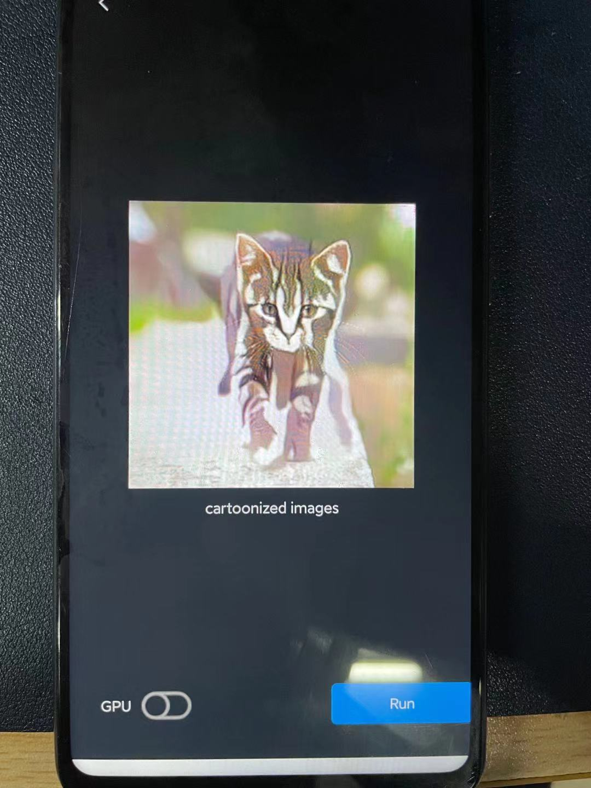

# Cartoonizer Demo 

这是一个将android摄像头动漫化的项目。

算法部分可以参考我的另一个[FacialCartoonization](https://github.com/BravoLu/FacialCartoonization)

## 使用方法

1. 该repo是基于TNN官方android demo修改的。模型转换，环境搭建等问题参考官方[repo](https://github.com/Tencent/TNN)。请确保能够运行官方的demo后再进行下面的操作。

2. 将目录下的C++文件放到TNN官方代码的./examples/base/下。

3. 将该目录下的其他文件放置到./examples/android/demo/src/main/并替换。

## 结果展示

